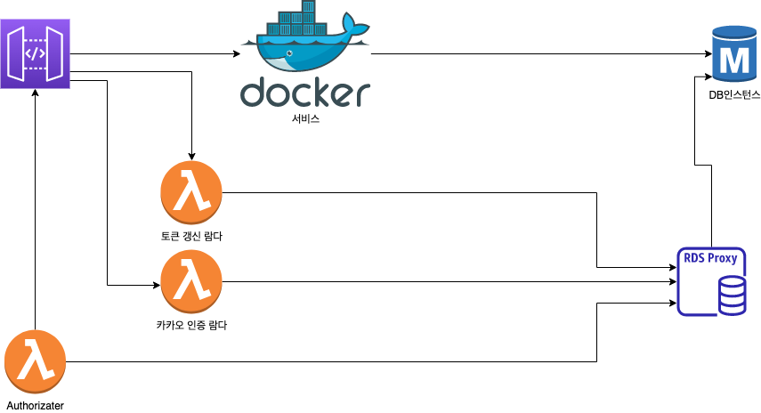

# 소개

- 틔우리 서비스에서 인증을 담당하는 서버
- 3가지의 람다함수로 존재

## 아키텍처

## 기능

1. 회원 가입: 네이티브 앱에서 카카오 로그인 후 실가입 절차를 진행하는 람다함수
2. 토큰 갱신: api-gateway에서 Authorizer의 역할을 하는 람다 함수
3. 토큰 갱신 함수: refresh token을 받아 access token을 갱신하는 람다 함수

